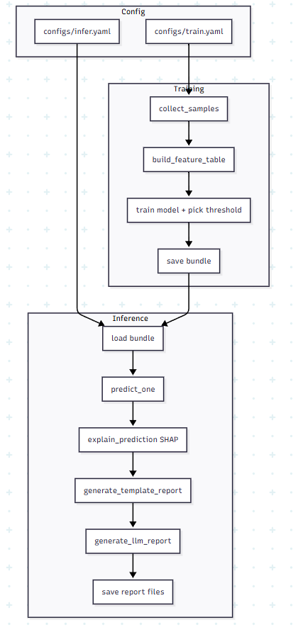

# AI_Anticheat_Report (AI Report + Simple ML)

`initial_plan.md`를 기반으로 만든 안티치트 분석 프로젝트임.

## 포함 기능

- parquet Window context 로그 로드 및 이진 분류 학습 (`cheater` vs `not_cheater`)
- 간단한 XAI 스타일 근거 추출 (중요 피처 Top-K)
- 운영자용 한국어 보고서 자동 생성
- LLM 연동 필수 (Ollama 또는 OpenAI)
- `artifacts/rule.md` 기반 정책 근거 RAG 추출 (ChromaDB)
- 백엔드 rule 기반 탐지 근거 추출(예정)

## 설치

필수 설치 항목:
- Ollama 설치 필요 (로컬 LLM 사용 시)
- ChromaDB 설치 필요 (정책 RAG 사용 시)

```bash
python -m venv .venv
.venv\Scripts\activate
pip install -r requirements.txt
```

Ollama 실행/모델 준비:

```bash
ollama serve
ollama pull gemma3(모델명은 상이할 수 있음.)
```

## 학습

데이터셋은 아래 링크에서 받을 수 있음.
- https://huggingface.co/datasets/CS2CD/Context_window_

```bash
python -m src.models.train_baseline --config configs/train.yaml
```

결과:
- `artifacts/model.joblib`
- `artifacts/model_meta.json`

## 추론 + 보고서 생성

사전 조건(둘 중 하나 필수):
- Ollama 로컬 서버 실행 (`ollama serve`) + 모델 준비 (예: `ollama pull gemma3`)
- 또는 OpenAI 키 설정 (`OPENAI_API_KEY`)

```bash
python -m src.pipeline.run_end_to_end --config configs/infer.yaml --input <parquet_file_path>
```

기본 `configs/infer.yaml`은 Ollama(`llm_provider: ollama`)를 사용함.

정책 RAG 설정:
- `report.policy_path`: 정책 문서 경로 (기본 `artifacts/rule.md`)
- `report.policy_top_k`: 리포트/LLM 프롬프트에 주입할 정책 근거 개수
- `report.policy_chroma_dir`: ChromaDB 영구 저장 디렉토리
- `report.policy_chroma_collection`: 정책 벡터 컬렉션 이름

주의:
- ChromaDB는 현재 일부 Python 3.14 환경에서 호환 이슈가 있을 수 있음.
- 정책 RAG를 안정적으로 쓰려면 Python 3.11~3.13 가상환경을 권장함.

문제 해결 팁:
- 404가 나면 `llm_model`이 설치된 모델과 다른 경우가 많음.
- 설치 모델 확인: `curl http://localhost:11434/api/tags`
- `configs/infer.yaml`의 `report.llm_model`을 실제 모델명으로 맞추면 됨.

결과:
- `artifacts/reports/report_*.md`
- `artifacts/reports/report_*.json`

## 참고

- 기본 구성은 샘플링 기반 MVP임. (`configs/train.yaml`의 `max_per_class`)
- 대규모 전체 학습 시 `max_per_class`를 제거하거나 증가시키면 됨.
- 최종 제재 판단은 운영자 수동 검토를 전제로 함.


## 프로젝트 구조

```text
AI_Anticheat_Report/
├─ configs/                  # 학습/추론 설정 파일
│  ├─ train.yaml             # 학습 샘플링/모델/출력 경로 설정
│  └─ infer.yaml             # 추론/리포트/LLM provider 설정
├─ context_windows_256/      # 입력 데이터셋 (parquet)
│  ├─ cheater/               # 치트 라벨 데이터
│  └─ not_cheater/           # 정상 라벨 데이터
├─ src/
│  ├─ data/
│  │  └─ load_parquet.py     # 파일 수집/라벨링/feature table 생성
│  ├─ features/
│  │  └─ window_features.py  # tick window -> tabular feature 변환
│  ├─ models/
│  │  ├─ train_baseline.py   # 학습/검증/threshold 선택/모델 저장
│  │  └─ predict.py          # 단건 예측/점수/위험등급 산출
│  ├─ xai/
│  │  └─ explain.py          # SHAP 기반 설명(Top-K 근거 피처)
│  ├─ reporting/
│  │  ├─ template_report.py  # 표준 양식 Markdown 리포트 생성
│  │  └─ llm_adapter.py      # Ollama/OpenAI 연동 어댑터
│  └─ pipeline/
│     └─ run_end_to_end.py   # 추론→XAI→리포트→LLM 요약 오케스트레이션
├─ artifacts/                # 실행 결과물
│  ├─ model.joblib
│  ├─ model_meta.json
│  └─ reports/
├─ tests/
│  ├─ test_data_loading.py
│  └─ test_inference_report.py
└─ README.md
```

## 디렉토리/코드 역할 상세

- `configs/`
	- 코드 수정 없이 실험 조건을 바꾸는 레이어임.
	- `train.yaml`은 학습 데이터 크기/모델/분할 비율을, `infer.yaml`은 LLM provider와 timeout을 제어함.
- `src/data/` + `src/features/`
	- 데이터 로딩과 피처 생성 책임을 분리해 유지보수를 쉽게 함.
	- 새로운 로그 컬럼이 생겨도 `window_features.py`만 수정하면 파이프라인 대부분이 재사용됨.
- `src/models/`
	- 학습(`train_baseline.py`)과 추론(`predict.py`)을 분리해 운영 파이프라인을 단순화함.
	- 학습 시 저장한 `feature_columns`, `threshold`를 추론에서 그대로 사용해 스키마 불일치를 최소화함.
- `src/xai/`
	- 모델 판정의 근거를 SHAP으로 계산해 상위 기여 피처를 반환함.
	- 보고서에 "왜 이 판정이 나왔는지"를 정량 근거로 제공함.
- `src/reporting/`
	- 템플릿 보고서(고정 양식)와 LLM 요약(자연어 요약)을 분리해 품질/안정성을 동시에 확보함.
	- LLM provider는 Ollama/OpenAI 중 설정으로 선택 가능함.
- `src/pipeline/`
	- 실제 운영 실행 진입점임.
	- `predict -> explain -> template report -> LLM summary`를 한 번에 수행함.
- `artifacts/`
	- 모델 버전과 리포트 결과가 누적되는 산출물 저장소임.
	- 배포/검증/회귀 분석 시 기준 데이터로 사용함.
- `tests/`
	- 로딩/추론/리포트의 최소 회귀 테스트를 담당함.
	- 리팩터링 후 핵심 기능이 깨졌는지 빠르게 확인 가능함.

## 실행 흐름 다이어그램


